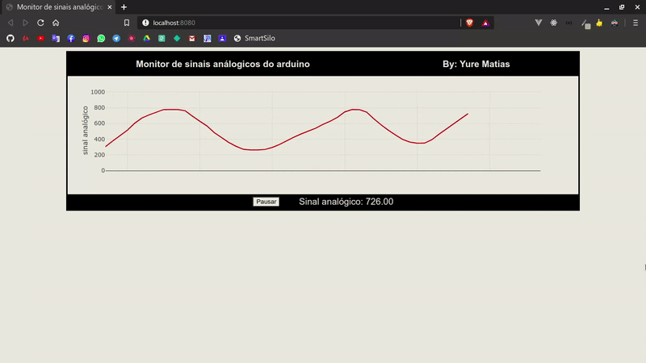

<h1>
Monitoramento de sinais analógicos do Arduino com JavaScript
</h1>

  Esse é uma aplicação exemplo presente no tutorial de minha autoria: <a href="https://smartsilo.netlify.app/html/dashboard.html">Monitoramento de sinais do Arduino com JavaScript</a> que ensina como construir um dashboard para monitoramento de sinais do Arduino usando apenas tecnologias da web como JavaScipt, HTML e CSS

<h2>Tecnologias utilizadas: </h2>
<ul>
  <li>
    <a href="https://developer.mozilla.org/pt-BR/docs/Aprender/JavaScript">JavaScript</a>
  </li>
  <li>
    <a href="https://developer.mozilla.org/pt-BR/docs/Web/HTML">HTML</a>
  </li>
  <li>
    <a href="https://developer.mozilla.org/pt-BR/docs/Web/CSS">CSS</a>
  </li>
  <li>
    <a href="https://plotly.com/javascript/">PlotlyJS</a>
  </li>
  <li>
    <a href="https://socket.io/">Socket.io</a>
  </li>
  <li>
    <a href="https://nodejs.org/en/">NodeJS</a>
  </li>
  <li>
    <a href="http://johnny-five.io/">Johnny-five</a>
  </li>
</ul>